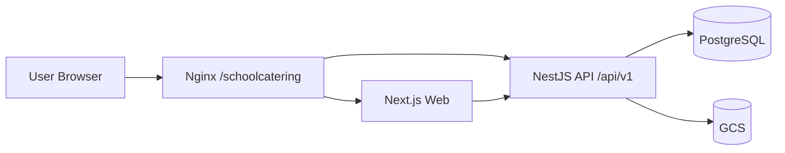
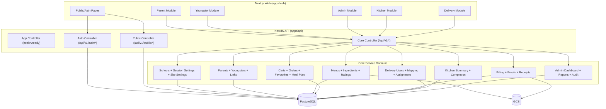

# Blossom School Catering Architecture

Last updated: 2026-03-10

## 1) Runtime Architecture

### Tech Stack
- Frontend: Next.js (`apps/web`), base path `/schoolcatering`
- Backend: NestJS (`apps/api`), API base `/api/v1`
- Database: PostgreSQL
- Runtime: PM2 + Nginx on VM
- Object storage: Google Cloud Storage (menu images, billing proofs, receipts)

### Runtime Components
- Nginx
  - serves `/schoolcatering`
  - proxies app/API traffic to PM2 processes
- Next.js Web (`schoolcatering-web`)
  - public pages + role modules (parent, youngster, admin, kitchen, delivery)
  - middleware role routing with auth token/role checks
- NestJS API (`schoolcatering-api`)
  - Auth module
  - Public module
  - Core module
  - global validation and throttling
- PostgreSQL
  - users, profiles, schools, sessions, menu, orders, billing, delivery, audit
- GCS
  - uploaded images + generated files

### Request Flow

```mermaid
flowchart LR
  U["User Browser"] --> N["Nginx /schoolcatering"]
  N --> W["Next.js Web"]
  N --> A["NestJS API /api/v1"]
  W --> A
  A --> P[(PostgreSQL)]
  A --> G[(GCS)]
```

## 2) API Module Boundaries

```mermaid
flowchart TB
  subgraph WEB["Next.js Web (apps/web)"]
    W1["Public/Auth Pages"]
    W2["Parent Module"]
    W3["Youngster Module"]
    W4["Admin Module"]
    W5["Kitchen Module"]
    W6["Delivery Module"]
  end

  subgraph API["NestJS API (apps/api)"]
    A0["App Controller (health/ready)"]
    A1["Auth Controller (/api/v1/auth/*)"]
    A2["Public Controller (/api/v1/public/*)"]
    A3["Core Controller (/api/v1/*)"]
  end

  subgraph DOMAINS["Core Service Domains"]
    C1["Schools + Session Settings + Site Settings"]
    C2["Parents + Youngsters + Links"]
    C3["Menus + Ingredients + Ratings"]
    C4["Carts + Orders + Favourites + Meal Plan"]
    C5["Billing + Proofs + Receipts"]
    C6["Delivery Users + Mapping + Assignment"]
    C7["Kitchen Summary + Completion"]
    C8["Admin Dashboard + Reports + Audit"]
  end

  DB[(PostgreSQL)]
  GCS[(GCS)]

  W1 --> A1
  W1 --> A2
  W2 --> A3
  W3 --> A3
  W4 --> A3
  W5 --> A3
  W6 --> A3

  A3 --> C1
  A3 --> C2
  A3 --> C3
  A3 --> C4
  A3 --> C5
  A3 --> C6
  A3 --> C7
  A3 --> C8

  A1 --> DB
  A2 --> DB
  C1 --> DB
  C2 --> DB
  C3 --> DB
  C4 --> DB
  C5 --> DB
  C6 --> DB
  C7 --> DB
  C8 --> DB

  C3 --> GCS
  C5 --> GCS
```

## 3) Key Architectural Rules
- Role checks are enforced in both layers:
  - frontend middleware
  - backend guards (`JwtAuthGuard`, `RolesGuard`)
- Auth model:
  - short-lived access token
  - refresh via HttpOnly cookie
- `apiFetch()` auto-reloads page after successful write calls unless `skipAutoReload` is enabled.
- Billing proof images are served through authenticated API stream endpoints.
- Ordering and fulfillment constraints are server-enforced:
  - session activation
  - blackout dates
  - cutoff handling
  - delivery/kitchen state transitions
- Parent delete guard:
  - parent cannot be deleted when linked to active youngster(s)

## 4) Core Data Domains (High-Level)
- Identity/Auth: `users`, `auth_refresh_sessions`, `user_preferences`, `user_identities`
- Profiles: `parents`, `children`, `parent_children`
- Calendar: `schools`, `session_settings`, `blackout_days`
- Menu: `menus`, `menu_items`, `ingredients`, `menu_item_ingredients`
- Ordering: `order_carts`, `cart_items`, `orders`, `order_items`, `order_mutations`
- Billing: `billing_records`, `digital_receipts`
- Delivery: `delivery_assignments`, `delivery_school_assignments`
- Reporting/Gamification: `child_badges`, `analytics_daily_agg`, audit logs

## 5) Operational Notes (Current)
- Delivery page supports arbitrary service-date fetch (`Show Service Date`) beyond only Yesterday/Today/Tomorrow.
- Admin delivery keeps a single assignment surface (`Auto Assignment`) with detailed per-order rows.
- Kitchen and admin-kitchen overview now include `Total Orders Complete`.
