# Blossom School Catering Architecture

Last updated: 2026-02-28

## 1) App Architecture (Latest State)

### Tech Stack
- Frontend: Next.js (`apps/web`), base path `/schoolcatering`
- Backend: NestJS (`apps/api`), API base `/api/v1`
- Database: PostgreSQL
- Process/runtime: PM2 + Nginx on VM
- Object storage: Google Cloud Storage (menu images, payment proofs, receipts)

### Runtime Components
- Nginx
  - Serves app under `/schoolcatering`
  - Proxies API requests to NestJS service
- Next.js Web App (`schoolcatering-web`)
  - Public pages: home, menu, guide, login/register
  - Protected role modules: parent, youngster, admin, kitchen, delivery
  - Middleware role-guards routes by auth token + role cookie
- NestJS API (`schoolcatering-api`)
  - Auth module: login/register/google/refresh/logout/onboarding
  - Core module: menu, carts/orders, billing, delivery, kitchen, admin operations
  - Global request validation via `ValidationPipe`
  - Global throttling via `ThrottlerModule` + `ThrottlerGuard`
- PostgreSQL
  - Stores users, profiles, menu data, carts/orders, billing, delivery, analytics
- GCS
  - Stores uploaded images and generated receipt PDFs

### Request Flow (Simplified)


### API Module Boundaries (Simplified)


### Key Architectural Rules
- Role-based access is enforced in both layers:
  - Web route middleware
  - API guards (`JwtAuthGuard`, `RolesGuard`)
- Access token used by frontend fetch wrapper, refresh token rotated via HttpOnly cookie.
- Ordering constraints enforced server-side:
  - session activation
  - blackout dates
  - cutoff windows
  - max-item rules

## 2) Database Schema ERD (Mermaid)

```mermaid
erDiagram
  USERS {
    uuid id PK
    string role
    string username
    string email
    bool is_active
  }

  USER_PREFERENCES {
    uuid id PK
    uuid user_id FK
    bool onboarding_completed
  }

  USER_IDENTITIES {
    uuid id PK
    uuid user_id FK
    string provider
    string provider_user_id
  }

  AUTH_REFRESH_SESSIONS {
    uuid id PK
    uuid user_id FK
    string token_hash
    timestamp expires_at
    timestamp revoked_at
  }

  PARENTS {
    uuid id PK
    uuid user_id FK
    string address
  }

  CHILDREN {
    uuid id PK
    uuid user_id FK
    uuid school_id FK
    string school_grade
    date date_of_birth
    string registration_actor_type
    string registration_actor_teacher_name
  }

  PARENT_CHILDREN {
    uuid id PK
    uuid parent_id FK
    uuid child_id FK
  }

  SCHOOLS {
    uuid id PK
    string name
    string city
    bool is_active
  }

  SESSION_SETTINGS {
    string session PK
    bool is_active
  }

  BLACKOUT_DAYS {
    uuid id PK
    date blackout_date
    string type
    string reason
  }

  MENUS {
    uuid id PK
    string session
    date service_date
    bool is_published
  }

  MENU_ITEMS {
    uuid id PK
    uuid menu_id FK
    string name
    numeric price
    bool is_available
  }

  INGREDIENTS {
    uuid id PK
    string name
    bool allergen_flag
    bool is_active
  }

  MENU_ITEM_INGREDIENTS {
    uuid id PK
    uuid menu_item_id FK
    uuid ingredient_id FK
  }

  ORDER_CARTS {
    uuid id PK
    uuid child_id FK
    uuid created_by_user_id FK
    string session
    date service_date
    string status
    timestamp expires_at
  }

  CART_ITEMS {
    uuid id PK
    uuid cart_id FK
    uuid menu_item_id FK
    int quantity
  }

  ORDERS {
    uuid id PK
    uuid cart_id FK
    uuid child_id FK
    uuid placed_by_user_id FK
    string session
    date service_date
    string status
    numeric total_price
    string delivery_status
  }

  ORDER_ITEMS {
    uuid id PK
    uuid order_id FK
    uuid menu_item_id FK
    int quantity
    numeric price_snapshot
  }

  ORDER_MUTATIONS {
    uuid id PK
    uuid order_id FK
    uuid actor_user_id FK
    string action
    json before_json
    json after_json
  }

  FAVOURITE_MEALS {
    uuid id PK
    uuid created_by_user_id FK
    uuid child_id FK
    string label
    string session
    bool is_active
  }

  FAVOURITE_MEAL_ITEMS {
    uuid id PK
    uuid favourite_meal_id FK
    uuid menu_item_id FK
    int quantity
  }

  BILLING_RECORDS {
    uuid id PK
    uuid order_id FK
    uuid parent_id FK
    string status
    string proof_image_url
    string delivery_status
  }

  DIGITAL_RECEIPTS {
    uuid id PK
    uuid billing_record_id FK
    string receipt_number
    string pdf_url
  }

  DELIVERY_USERS {
    uuid id PK
    uuid user_id FK
    bool is_active
  }

  DELIVERY_SCHOOL_ASSIGNMENTS {
    uuid delivery_user_id FK
    uuid school_id FK
    bool is_active
  }

  DELIVERY_ASSIGNMENTS {
    uuid id PK
    uuid order_id FK
    uuid delivery_user_id FK
    timestamp confirmed_at
    string confirmation_note
  }

  CHILD_BADGES {
    uuid id PK
    uuid child_id FK
    string badge_type
    timestamp earned_at
  }

  ANALYTICS_DAILY_AGG {
    date service_date
    string session
    uuid menu_item_id FK
    int total_qty
  }

  USERS ||--|| USER_PREFERENCES : has
  USERS ||--o{ USER_IDENTITIES : has
  USERS ||--o{ AUTH_REFRESH_SESSIONS : has

  USERS ||--|| PARENTS : maps_to
  USERS ||--|| CHILDREN : maps_to

  PARENTS ||--o{ PARENT_CHILDREN : links
  CHILDREN ||--o{ PARENT_CHILDREN : links

  SCHOOLS ||--o{ CHILDREN : enrolls

  MENUS ||--o{ MENU_ITEMS : contains
  MENU_ITEMS ||--o{ MENU_ITEM_INGREDIENTS : maps
  INGREDIENTS ||--o{ MENU_ITEM_INGREDIENTS : maps

  CHILDREN ||--o{ ORDER_CARTS : owns
  ORDER_CARTS ||--o{ CART_ITEMS : contains
  MENU_ITEMS ||--o{ CART_ITEMS : selected_in

  ORDER_CARTS ||--o{ ORDERS : submitted_to
  ORDERS ||--o{ ORDER_ITEMS : contains
  MENU_ITEMS ||--o{ ORDER_ITEMS : ordered_as

  ORDERS ||--o{ ORDER_MUTATIONS : audited_by
  USERS ||--o{ ORDER_MUTATIONS : actor

  USERS ||--o{ FAVOURITE_MEALS : creates
  CHILDREN ||--o{ FAVOURITE_MEALS : scoped_to
  FAVOURITE_MEALS ||--o{ FAVOURITE_MEAL_ITEMS : contains
  MENU_ITEMS ||--o{ FAVOURITE_MEAL_ITEMS : references

  PARENTS ||--o{ BILLING_RECORDS : billed
  ORDERS ||--|| BILLING_RECORDS : generates
  BILLING_RECORDS ||--o| DIGITAL_RECEIPTS : has

  USERS ||--|| DELIVERY_USERS : maps_to
  DELIVERY_USERS ||--o{ DELIVERY_SCHOOL_ASSIGNMENTS : mapped_to
  SCHOOLS ||--o{ DELIVERY_SCHOOL_ASSIGNMENTS : mapped_to

  DELIVERY_USERS ||--o{ DELIVERY_ASSIGNMENTS : assigned
  ORDERS ||--o| DELIVERY_ASSIGNMENTS : assigned

  CHILDREN ||--o{ CHILD_BADGES : earns
  MENU_ITEMS ||--o{ ANALYTICS_DAILY_AGG : aggregated_for
```



## 3) App File Structure

```text
blossom-schoolcatering/
├── apps/
│   ├── api/
│   │   ├── src/
│   │   │   ├── main.ts
│   │   │   ├── app.module.ts
│   │   │   ├── app.controller.ts
│   │   │   ├── auth/
│   │   │   │   ├── auth.controller.ts
│   │   │   │   ├── auth.service.ts
│   │   │   │   ├── jwt-auth.guard.ts
│   │   │   │   ├── roles.guard.ts
│   │   │   │   └── dto/
│   │   │   └── core/
│   │   │       ├── core.controller.ts
│   │   │       ├── core.service.ts
│   │   │       ├── public.controller.ts
│   │   │       └── dto/
│   │   └── test/
│   └── web/
│       ├── app/
│       │   ├── page.tsx
│       │   ├── login/page.tsx
│       │   ├── register/
│       │   ├── guide/page.tsx
│       │   ├── menu/page.tsx
│       │   ├── rating/page.tsx
│       │   ├── parents/page.tsx
│       │   ├── youngsters/page.tsx
│       │   ├── delivery/page.tsx
│       │   ├── kitchen/
│       │   ├── admin/
│       │   └── _components/
│       ├── lib/
│       │   ├── auth.ts
│       │   ├── dish-tags.ts
│       │   └── image.ts
│       ├── middleware.ts
│       └── public/
├── packages/
│   ├── types/
│   └── config/
├── docs/
│   ├── Features/
│   ├── specifications/
│   ├── guides/
│   ├── app_run/
│   ├── master_data/
│   └── versioning/
├── scripts/
├── README.md
├── plan.md
├── progress.md
└── Architecture.md
```
