# Blossom School Catering - Site, Navigation, API, and DB Map

Last synced: 2026-02-28
Base URL: `/schoolcatering`
API Base: `/schoolcatering/api/v1`

## 1) Page + Navigation Map

### Public / Entry
| Page | Purpose | Main Navigation / Redirect |
|---|---|---|
| `/` | Landing page | Links: Home, Login, Register |
| `/home` | Alias route for landing page | Same content as `/` |
| `/login` | Home login (Parent/Youngster) | On success -> `/dashboard` |
| `/register` | Registration role chooser | Links to `/register/youngsters`, `/register/delivery` |
| `/register/parent` | Legacy parent registration path | Redirects to `/register/youngsters` |
| `/register/youngsters` | Parent + Youngster combined registration with required registrant selector (`Youngster/Parent/Teacher`) and conditional teacher name | On success -> `/dashboard` |
| `/register/delivery` | Delivery registration (account role) | On success -> `/dashboard` |
| `/dashboard` | Post-login landing | Role-specific navigation continues |

### Role Login Pages
| Page | Role |
|---|---|
| `/admin/login` | Admin |
| `/kitchen/login` | Kitchen |
| `/delivery/login` | Delivery |
| `/parent/login` | Parent |
| `/youngster/login` | Youngster |

### Parent Module (mobile-first)
| Page | Purpose | Sub-sections in page |
|---|---|---|
| `/parent` | Alias (guarded) | Redirect/protected entry |
| `/parents` | Parent operations hub | Linked youngsters, youngster registration, menu+cart, favourites, consolidated orders, meal plan wizard, billing, spending dashboard |

### Youngster Module (mobile-first)
| Page | Purpose | Sub-sections in page |
|---|---|---|
| `/youngster` | Alias (guarded) | Redirect/protected entry |
| `/youngsters` | Youngster operations hub | Profile, weekly nutrition + badge, menu+cart, draft resume/discard |

### Delivery Module (mobile-first)
| Page | Purpose | Sub-sections in page |
|---|---|---|
| `/delivery` | Delivery daily assignments | Date filter, note input, mark-complete actions |

### Kitchen Module (desktop-priority)
| Page | Purpose |
|---|---|
| `/kitchen` | Kitchen today dashboard |
| `/kitchen/yesterday` | Kitchen daily dashboard for yesterday |
| `/kitchen/today` | Kitchen daily dashboard for today |
| `/kitchen/tomorrow` | Kitchen daily dashboard for tomorrow |

### Admin CMS (desktop-priority)
| Page | Purpose |
|---|---|
| `/admin` | Dashboard KPIs |
| `/admin/menu` | Full menu management |
| `/admin/parents` | Parent-child linking |
| `/admin/youngsters` | Youngster create/list |
| `/admin/schools` | School activation + session activation |
| `/admin/blackout-dates` | Blackout CRUD |
| `/admin/billing` | Billing verification + receipt generation |
| `/admin/delivery` | School-delivery mapping + auto-assign overview |
| `/admin/reports` | Revenue + printable report |
| `/admin/kitchen` | Admin kitchen landing |
| `/admin/backout-dates` | Placeholder page |

Admin top nav component: `Dashboard, Menu, Parents, Youngsters, Schools, Blackout Dates, Billing, Delivery, Reports, Kitchen`.

---

## 2) Page Fields Map (Forms + Inputs)

### `/login`
- `username`
- `password`
- `role` (`PARENT`, `YOUNGSTER`)
- Google OAuth button role-driven login

### Role login pages (`/admin/login`, `/kitchen/login`, `/delivery/login`, `/parent/login`, `/youngster/login`)
- `username`
- `password`

### Registration pages (`/register/*`)
- `role` (selected in form on `/register/youngsters`; route-fixed for delivery)
- `username`
- `password`
- `firstName`
- `lastName`
- `phoneNumber`
- `email` (required)
- `address` (required when role is `PARENT`)

### `/register/youngsters` (combined registration)
- `registrantType` (required): `YOUNGSTER | PARENT | TEACHER`
- `teacherName` (required when `registrantType=TEACHER`, max 50 chars)
- `youngsterFirstName`, `youngsterLastName`, `youngsterGender`, `youngsterDateOfBirth`, `youngsterSchoolId`, `youngsterGrade`, `youngsterPhone`, `youngsterEmail?`, `youngsterAllergies`
- `parentFirstName`, `parentLastName`, `parentMobileNumber`, `parentEmail`, `parentAddress?`
- Note: `parentAllergies` is no longer required on this flow

### `/parents` (single consolidated parent module page)
- Youngster selector: `selectedChildId`
- Youngster create fields:
  - `firstName`, `lastName`, `phoneNumber`, `email`, `dateOfBirth`, `gender`, `schoolId`, `schoolGrade`, `allergies`
- Menu/cart fields:
  - `serviceDate`, `session`, `search`, `priceMin`, `priceMax`, `allergenExclude`, `favouritesOnly`
  - Dynamic item quantity per menu item (`0..5`)
- Draft controls: resume/discard
- Favourite fields: `favLabel`
- Quick reorder fields: `quickReorderDate`
- Meal plan wizard fields: `wizardSourceOrderId`, `wizardDates[]`
- Billing proof input per billing record: `proofImageData`
- Edit-before-cutoff order fields:
  - `editServiceDate`, `editSession`, dynamic edit quantities (`0..5`)

### `/youngsters`
- Display fields: profile + allergies
- Nutrition display fields: week start/end, total calories, daily calories/TBA, badge level/metrics, birthday countdown
- Ordering fields:
  - `serviceDate`, `session`, dynamic item quantity per menu item (`0..5`)
- Draft controls: resume/discard

### `/delivery`
- `date`
- `note` (optional confirmation note)
- Assignment action: mark complete

### `/kitchen*`
- `date` driven by route offset (`yesterday/today/tomorrow`) and refresh control
- Read-only dashboard cards and lists (orders, allergen alerts, totals)

### `/admin`
- `date` (dashboard date)

### `/admin/menu`
- Context fields: `serviceDate`, `session`
- Menu item create/edit fields:
  - `name`, `description`, `nutritionFactsText`, `caloriesKcal`, `price`, `imageUrl` (or uploaded image as data URL), `ingredientIds[]`, `isAvailable`, `displayOrder`, `cutleryRequired`, `packingRequirement`
- Seed action for sample menu

### `/admin/parents`
- `selectedParentId`
- `selectedChildId`
- Link action parent <-> youngster

### `/admin/youngsters`
- `selectedParentId` (optional)
- `firstName`, `lastName`, `phoneNumber`, `email`, `dateOfBirth`, `gender`, `schoolId`, `schoolGrade`, `allergies`

### `/admin/schools`
- School status toggle per school (`isActive`)
- Session status toggle per session (`isActive` for `SNACK`, `BREAKFAST`; `LUNCH` fixed on)

### `/admin/blackout-dates`
- Create/update fields:
  - `blackoutDate`, `type` (`ORDER_BLOCK`/`SERVICE_BLOCK`/`BOTH`), `reason`
- Filter fields:
  - `fromDate`, `toDate`
- Delete action by blackout id

### `/admin/billing`
- `statusFilter`
- Actions per billing row:
  - verify, reject, generate receipt, open receipt URL

### `/admin/delivery`
- Mapping fields:
  - `selectedSchoolId`, `selectedDeliveryUserId`
- Auto-assign fields:
  - `assignDate`
- Mapping status toggle (active/inactive)

### `/admin/reports`
- Revenue range fields: `from`, `to`
- Daily report field: `date`
- Actions: refresh, print

---

## 3) API Endpoint Map (with request fields)

## Auth API (`/api/v1/auth`)
| Method | Path | Request fields |
|---|---|---|
| POST | `/login` | `username`/`identifier`, `password`, `role` |
| POST | `/register` | `role`, `username`, `password`, `firstName`, `lastName`, `phoneNumber`, `email`, `address?` |
| POST | `/register/youngsters` | `registrantType`, `teacherName?`, `youngsterFirstName`, `youngsterLastName`, `youngsterGender`, `youngsterDateOfBirth`, `youngsterSchoolId`, `youngsterGrade`, `youngsterPhone`, `youngsterEmail?`, `youngsterAllergies`, `parentFirstName`, `parentLastName`, `parentMobileNumber`, `parentEmail`, `parentAddress?` |
| POST | `/google/dev` | `googleEmail`, `role` |
| POST | `/google/verify` | `idToken`, `role` |
| GET | `/me` | Bearer token |
| POST | `/refresh` | `refreshToken` |
| POST | `/username/generate` | `base` |
| GET | `/onboarding` | Bearer token |
| POST | `/onboarding` | `completed` |
| POST | `/role-check` | `allowedRoles[]` |
| POST | `/logout` | `refreshToken` |
| POST | `/change-password` | `currentPassword`, `newPassword` |
| GET | `/admin-ping` | Bearer token (admin) |

## Core API (`/api/v1`)
| Method | Path | Roles | Request/query fields |
|---|---|---|---|
| GET | `/schools` | Parent/Youngster/Admin/Kitchen/Delivery | `active?` |
| PATCH | `/admin/schools/:schoolId` | Admin | `isActive` |
| GET | `/admin/session-settings` | Admin | - |
| PATCH | `/admin/session-settings/:session` | Admin | `isActive` |
| POST | `/children/register` | Parent/Admin | `firstName,lastName,phoneNumber,email?,dateOfBirth,gender,schoolId,schoolGrade,parentId?,allergies?` |
| GET | `/admin/parents` | Admin | - |
| GET | `/admin/children` | Admin | - |
| GET | `/admin/dashboard` | Admin | `date?` |
| GET | `/admin/revenue` | Admin | `from?`,`to?` |
| GET | `/admin/reports` | Admin | `date?` |
| GET | `/blackout-days` | Admin/Parent/Kitchen | `from_date?`,`to_date?` |
| POST | `/blackout-days` | Admin | `blackoutDate|blackout_date`, `type`, `reason?` |
| DELETE | `/blackout-days/:id` | Admin | - |
| GET | `/admin/ingredients` | Admin | - |
| GET | `/admin/menus` | Admin | `service_date`,`session` |
| POST | `/admin/menus/sample-seed` | Admin | `serviceDate?` |
| POST | `/admin/menu-items` | Admin | `serviceDate,session,name,description,nutritionFactsText,caloriesKcal?,price,imageUrl,ingredientIds[],isAvailable?,displayOrder?,cutleryRequired?,packingRequirement?` |
| PATCH | `/admin/menu-items/:itemId` | Admin | same as create (partial) |
| GET | `/children/me` | Youngster | - |
| GET | `/youngsters/me/insights` | Youngster | `date?` |
| GET | `/parents/me/children/pages` | Parent | - |
| POST | `/parents/:parentId/children/:childId/link` | Parent/Admin | - |
| GET | `/menus` | Parent/Youngster/Admin/Kitchen | `service_date,session?,search?,price_min?,price_max?,allergen_exclude?,favourites_only?` |
| GET | `/favourites` | Parent/Youngster | `child_id?`,`session?` |
| POST | `/favourites` | Parent/Youngster | `childId?,label,session,items[]` |
| POST | `/carts/quick-reorder` | Parent/Youngster | `sourceOrderId`,`serviceDate?` |
| POST | `/meal-plans/wizard` | Parent/Youngster | `childId?`,`sourceOrderId`,`dates[]` |
| POST | `/favourites/:favouriteId/apply` | Parent/Youngster | `serviceDate` |
| GET | `/billing/parent/consolidated` | Parent | - |
| POST | `/billing/:billingId/proof-upload` | Parent | `proofImageData` |
| GET | `/billing/:billingId/receipt` | Parent/Admin | - |
| GET | `/admin/billing` | Admin | `status?` |
| POST | `/admin/billing/:billingId/verify` | Admin | `decision` (`VERIFIED|REJECTED`) |
| POST | `/admin/billing/:billingId/receipt` | Admin | - |
| GET | `/delivery/users` | Admin | - |
| GET | `/delivery/school-assignments` | Admin | - |
| POST | `/delivery/school-assignments` | Admin | `deliveryUserId`,`schoolId`,`isActive?` |
| POST | `/delivery/auto-assign` | Admin | `date?` |
| POST | `/delivery/assign` | Admin | `orderIds[]`,`deliveryUserId` |
| GET | `/delivery/assignments` | Admin/Delivery | `date?` |
| POST | `/delivery/assignments/:assignmentId/confirm` | Delivery | `note?` |
| GET | `/carts` | Parent/Youngster/Admin | `child_id?`,`service_date?`,`session?` |
| POST | `/carts` | Parent/Youngster/Admin | `childId`,`serviceDate`,`session` |
| GET | `/carts/:cartId` | Parent/Youngster/Admin | - |
| PATCH | `/carts/:cartId/items` | Parent/Youngster/Admin | `items[]` (`menuItemId`,`quantity`) |
| DELETE | `/carts/:cartId` | Parent/Youngster/Admin | - |
| POST | `/carts/:cartId/submit` | Parent/Youngster/Admin | - |
| GET | `/orders/:orderId` | Parent/Youngster/Admin | - |
| GET | `/parents/me/orders/consolidated` | Parent | - |
| GET | `/parents/me/spending-dashboard` | Parent | `month?` |
| PATCH | `/orders/:orderId` | Parent/Youngster/Admin | `serviceDate?`,`session?`,`items[]` |
| DELETE | `/orders/:orderId` | Parent/Youngster/Admin | - |
| GET | `/kitchen/daily-summary` | Kitchen/Admin | `date?` |

---

## 4) DB Schema Map

## Core enum types
- `role_type`: `PARENT, CHILD, ADMIN, KITCHEN, DELIVERY`
- `session_type`: `LUNCH, SNACK, BREAKFAST`
- `gender_type`: `MALE, FEMALE, OTHER, UNDISCLOSED`
- `payment_status`: `UNPAID, PENDING_VERIFICATION, VERIFIED, REJECTED`
- `order_status`: `PLACED, CANCELLED, LOCKED`
- `blackout_type`: `ORDER_BLOCK, SERVICE_BLOCK, BOTH`
- `delivery_status`: `PENDING, ASSIGNED, OUT_FOR_DELIVERY, DELIVERED, FAILED`
- `cart_status`: `OPEN, SUBMITTED, EXPIRED`
- `badge_type`: `STREAK_7, STREAK_14, STREAK_30, WEEK_COMPLETE, MONTH_COMPLETE`
- `auth_provider_type`: `LOCAL, GOOGLE`

## Main runtime tables
| Table | Key fields | Primary relationships |
|---|---|---|
| `users` | `id, role, username, password_hash, first_name, last_name, phone_number, email, is_active` | base identity for all roles |
| `user_preferences` | `user_id, dark_mode_enabled, onboarding_completed` | `user_id -> users.id` |
| `user_identities` | `user_id, provider, provider_user_id, provider_email` | OAuth identities |
| `parents` | `id, user_id, address` | `user_id -> users.id` |
| `schools` | `id, name, city, address, is_active` | referenced by `children`, `academic_years`, delivery mapping |
| `academic_years` | `school_id, label, start_date, end_date, is_active` | school calendar master data |
| `academic_terms` | `academic_year_id, label, term_number, start_date, end_date` | terms under academic years |
| `children` | `id, user_id, school_id, date_of_birth, gender, school_grade, registration_actor_type, registration_actor_teacher_name, is_active` | youngster profile + registration source metadata |
| `parent_children` | `parent_id, child_id` | many-to-many parent-youngster links |
| `child_dietary_restrictions` | `child_id, restriction_label, restriction_details, is_active` | includes allergy text |
| `menus` | `session, service_date, is_published` | menu header per day/session |
| `ingredients` | `id, name, allergen_flag, is_active` | ingredient master |
| `menu_items` | `menu_id, name, description, nutrition_facts_text, calories_kcal, price, image_url, cutlery_required, packing_requirement, is_available, display_order` | dishes |
| `menu_item_ingredients` | `menu_item_id, ingredient_id` | dish-ingredient link |
| `blackout_days` | `blackout_date, type, reason, created_by` | ordering/service blocks |
| `order_carts` | `child_id, created_by_user_id, session, service_date, status, expires_at` | draft carts |
| `cart_items` | `cart_id, menu_item_id, quantity` | draft line items |
| `orders` | `order_number, cart_id, child_id, placed_by_user_id, session, service_date, status, total_price, dietary_snapshot, delivery_status` | confirmed orders |
| `order_items` | `order_id, menu_item_id, item_name_snapshot, price_snapshot, quantity` | order line items |
| `order_mutations` | `order_id, action, actor_user_id, before_json, after_json` | audit trail |
| `delivery_assignments` | `order_id, delivery_user_id, assigned_at, confirmed_at, confirmation_note` | delivery workflow |
| `billing_records` | `order_id, parent_id, status, proof_image_url, verified_by, delivery_status` | billing/payment lifecycle |
| `digital_receipts` | `billing_record_id, receipt_number, pdf_url` | generated receipts |
| `favourite_meals` | `created_by_user_id, child_id, label, session, is_active` | saved combos |
| `favourite_meal_items` | `favourite_meal_id, menu_item_id, quantity` | combo line items |
| `child_badges` | `child_id, badge_type, earned_at, streak_count` | gamification badges |
| `analytics_daily_agg` | `service_date, session, menu_item_id, total_qty` | analytics helper |
| `auth_refresh_sessions` | `jti, user_id, app_role, issued_at, expires_at, revoked_at` | JWT refresh-token session store |
| `delivery_school_assignments` | `delivery_user_id, school_id, is_active` | admin school->deliverer mapping (created by runtime service) |
| `session_settings` | `session, is_active` | admin session toggles (Lunch pinned active at API rule level) |

## DB-level rules/triggers/functions
- Parent max youngsters: trigger `trg_parent_child_limit` (`max 10`)
- Cart item max distinct items: trigger `trg_cart_item_limit` (`max 5`)
- Order item max distinct items: trigger `trg_order_item_limit` (`max 5`)
- Auto `updated_at` triggers on key tables
- Username generator function: `generate_unique_username(base_username)`
- Receipt number sequence: `receipt_number_seq` + formatter function (`BLC-YYYY-NNNNN`)

## Reporting views/materialized view
- `vw_order_facts`
- `vw_kitchen_summary_daily`, `vw_kitchen_summary_session`, `vw_kitchen_allergen_alerts`
- `vw_admin_slice_parent`, `vw_admin_slice_child`, `vw_admin_slice_meal`
- `vw_admin_slice_delivery_status`, `vw_admin_slice_payment_status`, `vw_admin_slice_time_session`, `vw_admin_slice_school`
- `vw_spending_by_parent`, `vw_parent_consolidated_orders`, `vw_parent_consolidated_billing`
- `vw_revenue_summary`, `vw_child_order_days`, `vw_child_nutrition_summary`
- `mv_admin_daily_rollup` + `refresh_mv_admin_daily_rollup()`
- `fn_kitchen_summary(p_service_date, p_session)`

---

## 5) Module Traceability (Pages -> API -> DB)

| Module | Pages | Primary API | Primary tables/views |
|---|---|---|---|
| Parent | `/parents` | `children/register`, `parents/me/children/pages`, `menus`, `carts*`, `orders*`, `favourites*`, `billing/parent/consolidated`, `billing/:id/proof-upload`, `parents/me/spending-dashboard` | `parents`, `children`, `parent_children`, `child_dietary_restrictions`, `menus`, `menu_items`, `order_carts`, `cart_items`, `orders`, `order_items`, `favourite_meals`, `favourite_meal_items`, `billing_records`, `digital_receipts`, `vw_spending_by_parent`, `vw_parent_consolidated_orders`, `vw_parent_consolidated_billing` |
| Youngster | `/youngsters` | `children/me`, `youngsters/me/insights`, `menus`, `carts*` | `children`, `child_dietary_restrictions`, `menus`, `menu_items`, `order_carts`, `cart_items`, `orders`, `order_items`, `child_badges`, `vw_child_nutrition_summary`, `vw_child_order_days` |
| Menu | `/parents`, `/youngsters`, `/admin/menu` | `menus`, `admin/ingredients`, `admin/menus`, `admin/menu-items`, `admin/menus/sample-seed` | `menus`, `menu_items`, `ingredients`, `menu_item_ingredients` |
| Ordering | `/parents`, `/youngsters` | `carts*`, `orders/:id`, `orders/:id PATCH/DELETE`, `carts/quick-reorder`, `meal-plans/wizard`, `favourites/:id/apply` | `order_carts`, `cart_items`, `orders`, `order_items`, `order_mutations` |
| Billing | `/parents`, `/admin/billing` | `billing/parent/consolidated`, `billing/:id/proof-upload`, `billing/:id/receipt`, `admin/billing`, `admin/billing/:id/verify`, `admin/billing/:id/receipt` | `billing_records`, `digital_receipts`, `orders`, `order_items`, `vw_parent_consolidated_billing` |
| Delivery | `/delivery`, `/admin/delivery` | `delivery/users`, `delivery/school-assignments`, `delivery/auto-assign`, `delivery/assignments`, `delivery/assignments/:id/confirm` | `delivery_assignments`, `delivery_school_assignments`, `orders`, `billing_records`, `schools`, `users` |
| Kitchen | `/kitchen*`, `/admin/kitchen` | `kitchen/daily-summary`, `blackout-days` (read) | `orders`, `order_items`, `menu_item_ingredients`, `ingredients`, `child_dietary_restrictions`, `vw_kitchen_summary_daily`, `vw_kitchen_allergen_alerts` |
| Admin | `/admin*` | `admin/dashboard`, `admin/revenue`, `admin/reports`, `admin/schools`, `admin/session-settings`, `blackout-days*` | `users`, `parents`, `children`, `schools`, `orders`, `billing_records`, `delivery_assignments`, `blackout_days`, `session_settings`, reporting views/materialized views |

---

## 6) Visual Map (Mermaid)

```mermaid
flowchart TD
  subgraph WEB["Web Pages (/schoolcatering)"]
    HOME["/ , /home"]
    LOGIN["/login + role login pages"]
    REG["/register/*"]
    PARENT["/parents"]
    YOUNG["/youngsters"]
    DELIV["/delivery"]
    KITCH["/kitchen, /kitchen/yesterday|today|tomorrow"]
    ADMIN["/admin + /admin/* CMS pages"]
  end

  subgraph API["API (/api/v1)"]
    AUTH["/auth/*"]
    CORE_SCHOOLS["schools + admin/schools + admin/session-settings"]
    CORE_CHILD["children/register, children/me, parents/me/children/pages"]
    CORE_MENU["menus, admin/ingredients, admin/menus, admin/menu-items"]
    CORE_ORDER["carts*, orders*, favourites*, quick-reorder, meal-plans/wizard"]
    CORE_BILL["billing/parent/consolidated, billing/*, admin/billing/*"]
    CORE_DELIV["delivery/users, delivery/school-assignments, delivery/assign*, confirm"]
    CORE_KITCH["kitchen/daily-summary"]
    CORE_REPORT["admin/dashboard, admin/revenue, admin/reports, blackout-days*"]
  end

  subgraph DB["PostgreSQL Schema"]
    T_USERS["users, user_preferences, user_identities, auth_refresh_sessions"]
    T_PEOPLE["parents, children, parent_children, child_dietary_restrictions"]
    T_MENU["schools, menus, menu_items, ingredients, menu_item_ingredients, session_settings, blackout_days"]
    T_ORDER["order_carts, cart_items, orders, order_items, order_mutations, favourite_meals, favourite_meal_items"]
    T_BILL["billing_records, digital_receipts, receipt_number_seq"]
    T_DELIV["delivery_assignments, delivery_school_assignments"]
    T_ANALYTICS["child_badges, analytics_daily_agg, vw_* reports, mv_admin_daily_rollup"]
  end

  HOME --> AUTH
  LOGIN --> AUTH
  REG --> AUTH

  PARENT --> CORE_CHILD
  PARENT --> CORE_MENU
  PARENT --> CORE_ORDER
  PARENT --> CORE_BILL
  PARENT --> CORE_REPORT

  YOUNG --> CORE_CHILD
  YOUNG --> CORE_MENU
  YOUNG --> CORE_ORDER
  YOUNG --> CORE_REPORT

  DELIV --> CORE_DELIV
  KITCH --> CORE_KITCH
  ADMIN --> CORE_SCHOOLS
  ADMIN --> CORE_CHILD
  ADMIN --> CORE_MENU
  ADMIN --> CORE_BILL
  ADMIN --> CORE_DELIV
  ADMIN --> CORE_REPORT
  ADMIN --> CORE_KITCH

  AUTH --> T_USERS
  CORE_SCHOOLS --> T_MENU
  CORE_CHILD --> T_PEOPLE
  CORE_MENU --> T_MENU
  CORE_ORDER --> T_ORDER
  CORE_ORDER --> T_PEOPLE
  CORE_ORDER --> T_MENU
  CORE_BILL --> T_BILL
  CORE_BILL --> T_ORDER
  CORE_DELIV --> T_DELIV
  CORE_DELIV --> T_ORDER
  CORE_DELIV --> T_MENU
  CORE_KITCH --> T_ANALYTICS
  CORE_KITCH --> T_ORDER
  CORE_REPORT --> T_ANALYTICS
  CORE_REPORT --> T_MENU
```

