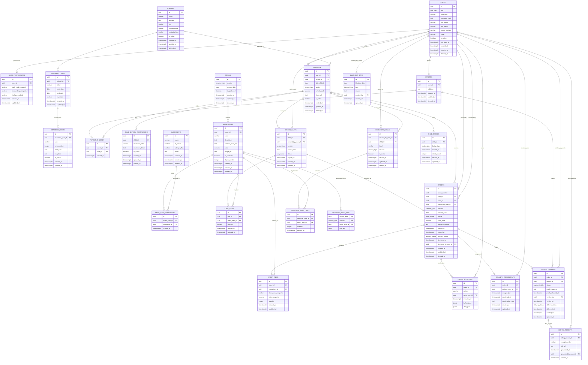

# Blossom School Catering Database Schema

```mermaid
erDiagram
  USERS {
    uuid id PK
    role_type role
    varchar username
    text password_hash
    varchar first_name
    varchar last_name
    varchar phone_number
    varchar email
    boolean is_active
    timestamptz last_login_at
    timestamptz created_at
    timestamptz updated_at
    timestamptz deleted_at
  }

  USER_PREFERENCES {
    uuid id PK
    uuid user_id FK
    boolean dark_mode_enabled
    boolean onboarding_completed
    boolean tooltips_enabled
    timestamptz created_at
    timestamptz updated_at
  }

  PARENTS {
    uuid id PK
    uuid user_id FK
    text address
    timestamptz created_at
    timestamptz updated_at
    timestamptz deleted_at
  }

  SCHOOLS {
    uuid id PK
    varchar name
    text address
    varchar city
    varchar contact_email
    varchar contact_phone
    boolean is_active
    timestamptz created_at
    timestamptz updated_at
    timestamptz deleted_at
  }

  ACADEMIC_YEARS {
    uuid id PK
    uuid school_id FK
    varchar label
    date start_date
    date end_date
    boolean is_active
    timestamptz created_at
    timestamptz updated_at
  }

  ACADEMIC_TERMS {
    uuid id PK
    uuid academic_year_id FK
    varchar label
    integer term_number
    date start_date
    date end_date
    boolean is_active
    timestamptz created_at
    timestamptz updated_at
  }

  CHILDREN {
    uuid id PK
    uuid user_id FK
    uuid school_id FK
    date date_of_birth
    gender_type gender
    varchar school_grade
    text photo_url
    boolean is_active
    timestamptz created_at
    timestamptz updated_at
    timestamptz deleted_at
  }

  PARENT_CHILDREN {
    uuid id PK
    uuid parent_id FK
    uuid child_id FK
    timestamptz created_at
  }

  CHILD_DIETARY_RESTRICTIONS {
    uuid id PK
    uuid child_id FK
    varchar restriction_label
    text restriction_details
    boolean is_active
    timestamptz created_at
    timestamptz updated_at
    timestamptz deleted_at
  }

  MENUS {
    uuid id PK
    session_type session
    date service_date
    boolean is_published
    timestamptz created_at
    timestamptz updated_at
    timestamptz deleted_at
  }

  INGREDIENTS {
    uuid id PK
    varchar name
    boolean is_active
    boolean allergen_flag
    text notes
    timestamptz created_at
    timestamptz updated_at
    timestamptz deleted_at
  }

  MENU_ITEMS {
    uuid id PK
    uuid menu_id FK
    varchar name
    text description
    text nutrition_facts_text
    numeric price
    text image_url
    boolean is_available
    integer display_order
    timestamptz created_at
    timestamptz updated_at
    timestamptz deleted_at
  }

  MENU_ITEM_INGREDIENTS {
    uuid id PK
    uuid menu_item_id FK
    uuid ingredient_id FK
    timestamptz created_at
  }

  BLACKOUT_DAYS {
    uuid id PK
    date blackout_date
    blackout_type type
    text reason
    uuid created_by FK
    timestamptz created_at
    timestamptz updated_at
  }

  ORDER_CARTS {
    uuid id PK
    uuid child_id FK
    uuid created_by_user_id FK
    session_type session
    date service_date
    cart_status status
    timestamptz expires_at
    timestamptz created_at
    timestamptz updated_at
  }

  CART_ITEMS {
    uuid id PK
    uuid cart_id FK
    uuid menu_item_id FK
    integer quantity
    timestamptz created_at
    timestamptz updated_at
  }

  ORDERS {
    uuid id PK
    uuid order_number
    uuid cart_id FK
    uuid child_id FK
    uuid placed_by_user_id FK
    session_type session
    date service_date
    order_status status
    numeric total_price
    text dietary_snapshot
    timestamptz placed_at
    timestamptz locked_at
    delivery_status delivery_status
    timestamptz delivered_at
    uuid delivered_by_user_id FK
    timestamptz created_at
    timestamptz updated_at
    timestamptz deleted_at
  }

  ORDER_ITEMS {
    uuid id PK
    uuid order_id FK
    uuid menu_item_id FK
    varchar item_name_snapshot
    numeric price_snapshot
    integer quantity
    timestamptz created_at
    timestamptz updated_at
  }

  ORDER_MUTATIONS {
    uuid id PK
    uuid order_id FK
    varchar action
    uuid actor_user_id FK
    timestamptz mutation_at
    jsonb before_json
    jsonb after_json
  }

  DELIVERY_ASSIGNMENTS {
    uuid id PK
    uuid order_id FK
    uuid delivery_user_id FK
    timestamptz assigned_at
    timestamptz confirmed_at
    text confirmation_note
    timestamptz created_at
    timestamptz updated_at
  }

  BILLING_RECORDS {
    uuid id PK
    uuid order_id FK
    uuid parent_id FK
    payment_status status
    text proof_image_url
    timestamptz proof_uploaded_at
    uuid verified_by FK
    timestamptz verified_at
    delivery_status delivery_status
    timestamptz delivered_at
    timestamptz created_at
    timestamptz updated_at
  }

  DIGITAL_RECEIPTS {
    uuid id PK
    uuid billing_record_id FK
    varchar receipt_number
    text pdf_url
    timestamptz generated_at
    uuid generated_by_user_id FK
    timestamptz created_at
  }

  FAVOURITE_MEALS {
    uuid id PK
    uuid created_by_user_id FK
    uuid child_id FK
    varchar label
    session_type session
    boolean is_active
    timestamptz created_at
    timestamptz updated_at
    timestamptz deleted_at
  }

  FAVOURITE_MEAL_ITEMS {
    uuid id PK
    uuid favourite_meal_id FK
    uuid menu_item_id FK
    integer quantity
    timestamptz created_at
  }

  CHILD_BADGES {
    uuid id PK
    uuid child_id FK
    badge_type badge_type
    timestamptz earned_at
    integer streak_count
    timestamptz created_at
    timestamptz updated_at
  }

  ANALYTICS_DAILY_AGG {
    date service_date PK
    session_type session PK
    uuid menu_item_id PK
    bigint total_qty
  }

  USERS ||--o| USER_PREFERENCES : "preferences"
  USERS ||--o| PARENTS : "profile"
  USERS ||--o| CHILDREN : "profile"
  SCHOOLS ||--o{ ACADEMIC_YEARS : "has"
  SCHOOLS ||--o{ CHILDREN : "enrolled_in"
  ACADEMIC_YEARS ||--o{ ACADEMIC_TERMS : "divided_into"
  PARENTS ||--o{ PARENT_CHILDREN : "has"
  CHILDREN ||--o{ PARENT_CHILDREN : "linked"
  CHILDREN ||--o{ CHILD_DIETARY_RESTRICTIONS : "has"
  CHILDREN ||--o{ CHILD_BADGES : "earns"
  MENUS ||--o{ MENU_ITEMS : "contains"
  MENU_ITEMS ||--o{ MENU_ITEM_INGREDIENTS : "uses"
  INGREDIENTS ||--o{ MENU_ITEM_INGREDIENTS : "selected_in"
  USERS ||--o{ BLACKOUT_DAYS : "created_by_admin"
  CHILDREN ||--o{ ORDER_CARTS : "has_cart"
  USERS ||--o{ ORDER_CARTS : "cart_creator"
  ORDER_CARTS ||--o{ CART_ITEMS : "contains"
  MENU_ITEMS ||--o{ CART_ITEMS : "in_cart"
  ORDER_CARTS ||--o| ORDERS : "submitted_as"
  CHILDREN ||--o{ ORDERS : "receives"
  USERS ||--o{ ORDERS : "placed_by"
  USERS ||--o{ ORDERS : "delivered_by"
  ORDERS ||--o{ ORDER_ITEMS : "contains"
  MENU_ITEMS ||--o{ ORDER_ITEMS : "ordered_as"
  ORDERS ||--o{ ORDER_MUTATIONS : "audited_by"
  USERS ||--o{ ORDER_MUTATIONS : "actor"
  ORDERS ||--o| DELIVERY_ASSIGNMENTS : "assignment"
  USERS ||--o{ DELIVERY_ASSIGNMENTS : "delivery_user"
  ORDERS ||--o| BILLING_RECORDS : "billing"
  PARENTS ||--o{ BILLING_RECORDS : "payer"
  USERS ||--o{ BILLING_RECORDS : "verified_by_admin"
  BILLING_RECORDS ||--o| DIGITAL_RECEIPTS : "has_receipt"
  USERS ||--o{ DIGITAL_RECEIPTS : "generated_by"
  USERS ||--o{ FAVOURITE_MEALS : "saved_by"
  CHILDREN ||--o{ FAVOURITE_MEALS : "for_child"
  FAVOURITE_MEALS ||--o{ FAVOURITE_MEAL_ITEMS : "contains"
  MENU_ITEMS ||--o{ FAVOURITE_MEAL_ITEMS : "in_favourite"
  MENU_ITEMS ||--o{ ANALYTICS_DAILY_AGG : "aggregated_item"
```
